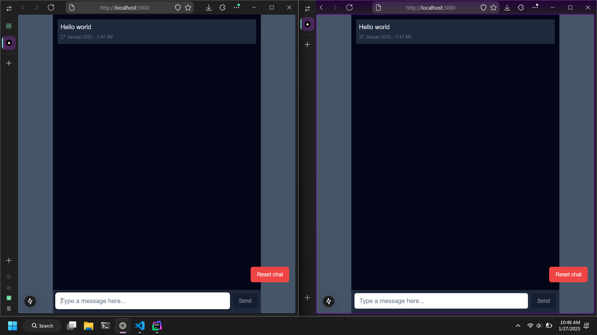

# Simple Websocket App



> ℹ️ This simple application was created for test purposes at the [Blsky](https://blsky.tech) company.

## Tech Stack
Some of the technologies used in this project:
- [Next.js](https://nextjs.org) — The React Framework
- [Socket.io](https://socket.io) — WebSocket library
- [PostgreSQL](https://www.postgresql.org) — A relational database
- [Kysely](https://github.com/koskimas/kysely) — A type-safe TypeScript SQL query builder
- [Tailwind CSS](https://tailwindcss.com) — A utility-first CSS framework
- [TypeScript](https://typescriptlang.org) — A typed superset of JavaScript
- [Biome](https://biomejs.dev) - Code formatter and linter

## Getting Started

### Prerequisites

- Node.js 18.x or higher
- PostgreSQL 14.x or higher
- [pnpm](https://pnpm.io) (optional but recommended)

### Installation

1. Clone the repository:

```bash
git clone https://github.com/up2dul/blsky-fe.git

# or if you prefer SSH
git clone git@github.com:up2dul/blsky-fe.git
```

2. Install the dependencies:

```bash
cd blsky-fe
pnpm install
```

3. Create a `.env` file based on the `.env.example` file:

```bash
cp .env.example .env
```

4. Replace the `DATABASE_URL` value with your own.

5. Run the database migration:

```bash
pnpm db:migrate
```

### Usage

1. Start the development server:

```bash
pnpm dev
```

2. Open [http://localhost:3000](http://localhost:3000) in your browser.
